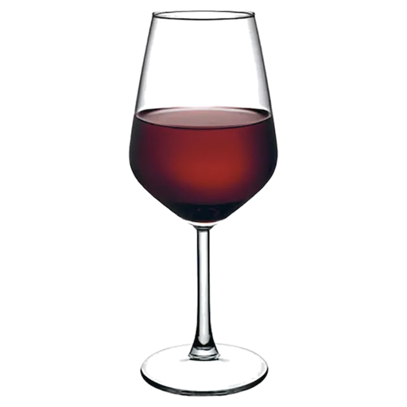

# 🍷 Millésime — Cave à Vin pour Home Assistant

<p align="center">
  
</p>

<p align="center">
  
  
  
  
</p>

<p align="center">
  <a href="https://www.paypal.com/donate/?business=MWJCVFGTNC4T4&amp;no_recurring=1&amp;currency_code=EUR">
    
  </a>
</p>

> Gérez et visualisez votre cave à vin dans Home Assistant.  
> Design inspiré Vinotag — cercles colorés sur clayettes bois.  
> Recherche automatique via **Gemini 1.5 Flash** (notes de dégustation, accords) avec fallback **Open Food Facts**.

---

## ✨ Fonctionnalités

- 🍾 **Visualisation style Vinotag** — cercles colorés par type de vin sur clayettes bois animées
- 🏗️ **Multi-étages** — créez autant d'étages que votre cave en contient
- ↕️ **Deux dispositions** — côte à côte ou tête-bêche par étage
- 🔍 **Recherche intelligente** — tapez 3 lettres, les suggestions arrivent en temps réel
- 🤖 **Gemini 1.5 Flash** *(clé optionnelle)* — notes de dégustation, accords mets-vins, fenêtre de consommation
- 🌐 **Open Food Facts** — fallback gratuit, sans clé, 150 000+ vins
- 📷 **Scan d'étiquette par photo** — prenez une photo, Gemini remplit tout automatiquement
- 📋 **Fiche bouteille complète** — prix, millésime, appellation, région, arômes, accords, note
- 🎨 **Filtres par type** — rouge, blanc, rosé, effervescent, liquoreux
- 📊 **3 capteurs HA** — total bouteilles, valeur estimée, nombre d'étages
- 📱 **Mobile-first** — modal bottom-sheet, optimisé iPhone et Android

---

## 🚀 Installation

### Méthode 1 — HACS (recommandée)

1. Ouvrez HACS → **Intégrations** → ⋮ → **Dépôts personnalisés**
2. Ajoutez `https://github.com/yourusername/ha-millesime` (catégorie : Intégration)
3. Installez **Millésime**
4. Redémarrez Home Assistant

### Méthode 2 — Manuelle

```
custom_components/millesime/  →  config/custom_components/millesime/
www/millesime/                →  config/www/millesime/
```

### Enregistrer la ressource Lovelace

**Paramètres → Tableaux de bord → Ressources → +**

```
URL  : /local/millesime/millesime-card.js
Type : Module JavaScript
```

### Ajouter l'intégration

**Paramètres → Appareils & Services → + Ajouter → Millésime**

Renseignez le nom de votre cave et, optionnellement, votre **clé API Gemini** (obtenez-la gratuitement sur [aistudio.google.com](https://aistudio.google.com/app/apikey)).

### Ajouter la carte Lovelace

```yaml
type: custom:millesime-card
```

---

## 🔍 Recherche de vins

### Avec clé Gemini *(recommandé)*

Gemini 1.5 Flash fournit des données riches pour chaque vin :

| Champ | Exemple |
|---|---|
| Nom + millésime | Château Margaux 2018 |
| Appellation | Margaux, Médoc |
| Notes de dégustation | Cassis, cèdre, violette, finale tannique soyeuse |
| Accords mets-vins | Agneau rôti, magret de canard, fromages affinés |
| Fenêtre de dégustation | 2024 — 2045 |
| Note estimée | 4.7 / 5 |

**Limites Gemini 1.5 Flash gratuit** : 1 500 requêtes/jour — largement suffisant.  
La clé est personnelle : chaque utilisateur fournit la sienne, vous ne payez rien pour les autres.

### Sans clé *(Open Food Facts)*

150 000+ vins, photos des étiquettes, régions et appellations. Pas de notes de dégustation.

### Scan d'étiquette 📷

Bouton 📷 dans le formulaire → photo de la bouteille → Gemini identifie le vin et remplit tous les champs.

---

## 🖥️ Utilisation

### Créer un étage
Cliquez **+ Étage** → nom, colonnes, rangées, disposition (côte à côte / tête-bêche).

### Ajouter une bouteille
- Cliquez **+ Vin** ou directement sur un emplacement vide
- Tapez le nom → sélectionnez dans les suggestions → tout se remplit
- Ou 📷 pour scanner l'étiquette

### Consulter une bouteille
- **1er clic** → sélection (contour doré)
- **2e clic** → fiche détail complète avec notes de dégustation et accords

---

## 📁 Structure

```
ha-millesime/
├── custom_components/
│   └── millesime/
│       ├── __init__.py          ← Backend : WebSocket + Gemini + OFF + services
│       ├── config_flow.py       ← Configuration UI (nom cave + clé Gemini)
│       ├── sensor.py            ← 3 capteurs HA
│       ├── manifest.json
│       ├── icon.png             ← Icône 512×512 HACS
│       ├── strings.json
│       └── translations/
│           └── fr.json
├── www/
│   └── millesime/
│       └── millesime-card.js   ← Carte Lovelace
├── hacs.json
└── README.md
```

Les données sont stockées dans `/homeassistant/millesime_data.json`.

---

## 📡 Capteurs disponibles

| Entité | Description | Unité |
|---|---|---|
| `sensor.millesime_bouteilles` | Nombre total de bouteilles | bouteilles |
| `sensor.millesime_valeur` | Valeur estimée de la cave | € |
| `sensor.millesime_etages` | Nombre d'étages | étages |

---

## ⚙️ Architecture technique

La carte Lovelace communique avec le backend Python via **WebSocket HA natif** — connexion déjà authentifiée, zéro token HTTP.

**Commandes WebSocket :**
- `millesime/get_data` — charge toutes les données de la cave
- `millesime/search_wine` — recherche texte (Gemini ou OFF selon config)
- `millesime/analyze_photo` — analyse photo d'étiquette via Gemini Vision

**Recherche Gemini :**  
Cache in-memory 5 minutes — économise les quotas lors de la frappe lettre par lettre.  
Fallback automatique sur Open Food Facts si Gemini échoue ou si pas de clé.

---

## 🔑 Clé Gemini — obtenir et configurer

1. Allez sur [aistudio.google.com/app/apikey](https://aistudio.google.com/app/apikey)
2. Connectez-vous avec un compte Google → **Create API Key**
3. Dans HA : **Paramètres → Appareils → Millésime → ⚙️ Configurer**

La clé peut être ajoutée ou modifiée à tout moment sans réinstaller l'intégration.

---

## 📋 Changelog

### v3.1.1 *(actuelle)*
- ✅ Icône 512×512 pour HACS / Home Assistant
- ✅ Clé Gemini modifiable via Options Flow sans réinstaller
- ✅ Cache recherche 5 min (économise les quotas Gemini)
- ✅ Retry automatique ×3 sur erreurs réseau Open Food Facts
- ✅ Scan d'étiquette par photo (Gemini Vision)
- ✅ Champs `tasting_notes` et `food_pairing` dans la fiche bouteille

### v3.1.0
- ✅ Intégration Gemini 1.5 Flash (1 500 req/jour gratuit, clé par utilisateur)
- ✅ Open Food Facts en fallback (gratuit, sans clé, illimité, HACS-compatible)
- ✅ Double stratégie de recherche avec/sans accents
- ✅ Config Flow avec champ clé Gemini optionnel

### v3.0.1
- ✅ Import `websocket_api` corrigé pour HA 2024+
- ✅ Communication via WebSocket natif HA (zéro problème d'auth)
- ✅ Design : fond noir profond, rouge rubis, clayette bois

### v3.0.0
- Réécriture complète — stockage JSON fichier local
- Nouveau design inspiré Vinotag

---

## 📄 Licence

MIT — libre d'utilisation, modification et distribution.

---

*Santé ! 🥂*
